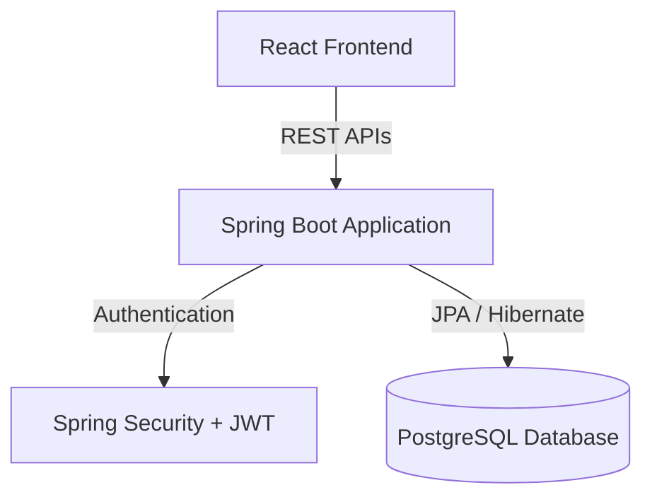

# 🎓 PrepWise - AI Powered KCET Preparation Platform (Backend)


## 📖 Overview

**PrepWise** is an AI-powered learning platform designed to help KCET aspirants prepare more effectively through personalized practice and performance analysis. 

Unlike traditional practice platforms, PrepWise tracks each student's progress, identifies strengths and weaknesses, and recommends what to study next based on previous performance. The first version focuses on **Physics** (Units & Measurements, Laws of Motion, Work, Energy & Power), with plans to expand to Chemistry, Mathematics, and the complete KCET syllabus.

This repository contains the **Spring Boot Backend** for the platform.

---

## ✨ Features

### 🔐 Student Authentication
- Email & Password Login
- JWT Authentication
- Role-Based Access (Student & Admin)
- BCrypt Password Encryption

### 📝 Daily Practice Tests
- Daily MCQ-based tests
- Easy, Medium, and Hard questions
- Topic-wise question distribution

### 📊 Performance Analysis
- Score tracking & Accuracy calculation
- Time taken analysis
- Topic-wise progress monitoring

### 🧠 Personalized Learning
- Recommend next topics based on performance
- Identify weak chapters & schedule revision
- Adaptive learning roadmap

### 🛠️ Admin Portal
- Add Chapters, Topics, and Questions
- Manage Question Bank

---

## 💻 Technology Stack

### Backend Core
- **Java 17 / 21**
- **Spring Boot**
- **Spring Security**
- **Spring Data JPA (Hibernate)**
- **Maven** (Dependency Management)

### Database
- **PostgreSQL**
  - *Main tables*: Users, Chapters, Topics, Questions, Tests, Attempts, Topic Progress

### Security & Utilities
- **JWT (JSON Web Tokens)** for secure API authentication
- **Lombok** to reduce boilerplate code

---

## 🏗️ Architecture



---

## 🚀 Getting Started

### Prerequisites

Ensure you have the following installed on your local machine:
- **Java Development Kit (JDK) 17** or higher
- **Maven** (optional, wrapper is included)
- **PostgreSQL** database running locally or remotely

### Installation & Setup

1. **Clone the repository:**
   ```bash
   git clone <your-repository-url>
   cd prepwise-backend
   ```

2. **Configure the Database:**
   Update the `src/main/resources/application.properties` or `application.yml` file with your PostgreSQL credentials:
   ```properties
   spring.datasource.url=jdbc:postgresql://localhost:5432/prepwise_db
   spring.datasource.username=your_username
   spring.datasource.password=your_password
   ```

3. **Build the project:**
   ```bash
   ./mvnw clean install
   ```

4. **Run the application:**
   ```bash
   ./mvnw spring-boot:run
   ```
   The server will start on `http://localhost:8080`.

---

## 📈 Development Progress

- [x] Project setup & Database schema design
- [x] User entity & Role enum
- [x] Repository and DTO layers
- [x] Authentication service structure & Spring Security config
- [x] PostgreSQL integration
- [ ] JWT authentication APIs (Register & Login)
- [ ] Admin dashboard & Question management
- [ ] Daily test generation & Performance analytics
- [ ] AI recommendation engine

---

## 🎯 Long-Term Vision

PrepWise aims to become an intelligent study companion for KCET students by combining structured practice, analytics, and AI-driven recommendations. The platform will continuously adapt to each student's learning journey and provide personalized guidance for better exam preparation.

---
*Made with ❤️ for KCET Aspirants.*
