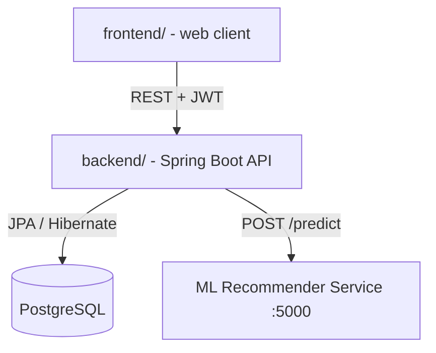

# 🎓 PrepWise

**PrepWise** is an AI-powered exam-preparation platform (initial target: **KCET**) that helps
students practice with personalized tests and tracks their performance per topic.

This repository is organized as a monorepo:

| Folder                   | What it is                                             | Status         |
| ------------------------ | ------------------------------------------------------ | -------------- |
| [`backend/`](backend/)   | Spring Boot REST API (Java 17, PostgreSQL, JWT auth)   | Active         |
| [`frontend/`](frontend/) | Web client that consumes the backend API               | Planned        |

## Getting started

- **Backend** — see [`backend/README.md`](backend/README.md) for setup, configuration,
  the full API reference, and default seed data. It runs on `http://localhost:8084`.
- **Frontend** — not scaffolded yet; see [`frontend/README.md`](frontend/README.md).

## Architecture

---
*Built for exam aspirants.*
