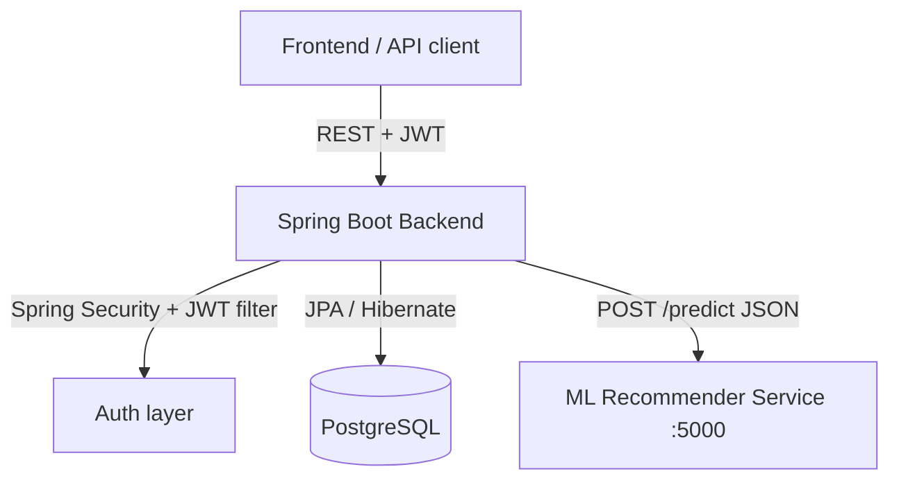

# 🎓 PrepWise — AI‑Powered Exam Preparation Platform (Backend)


PrepWise is a learning platform that helps students prepare for competitive exams (initial
target: **KCET**) through personalized practice tests and performance tracking. It tracks each
student's answers per topic, feeds that history to an external ML recommender, and generates the
next practice test from the recommendations (falling back to the question bank when the model is
unavailable).

This repository is the **Spring Boot REST backend**.

> **Before you run:** a fresh clone needs one setup step — create `application-local.properties`
> with your database credentials and a JWT secret. See **[Getting Started](#-getting-started)**.

---

## ✨ What the backend does

- **Authentication & authorization** — register/login with BCrypt‑hashed passwords, stateless JWT
  bearer tokens, and two roles (`STUDENT`, `ADMIN`).
- **Content management (admin)** — CRUD for the content hierarchy:
  `Subject → Unit → Chapter → Topic → Question`.
- **Practice tests (student)** — generate a test for a topic, submit answers, and get a score.
- **Progress tracking** — per‑user, per‑topic record of which questions were answered correctly.
- **ML‑driven recommendations** — calls an external prediction service to pick questions based on
  the student's solved/wrong history, with a graceful fallback to the topic's question bank.

---

## 💻 Tech Stack

| Layer            | Technology                                             |
| ---------------- | ------------------------------------------------------ |
| Language         | Java 17+ (build/run pinned to **Java 17/21**; see notes) |
| Framework        | Spring Boot **4.1.0** (Web MVC, Data JPA, Security, Validation) |
| Persistence      | Spring Data JPA / Hibernate over **PostgreSQL**        |
| Auth             | **JJWT 0.12.7** (HS256), BCrypt password encoder       |
| Build            | Maven (wrapper included), Lombok                       |
| External service | ML recommender microservice (HTTP/JSON)                |

---

## 🏗️ Architecture



**Layering** (per feature): `Controller → Service → Repository → Entity`, with request/response
**DTOs** decoupling the API from the JPA entities.

### Package layout

```
com.prepwise.prepwise_backend
├── PrepwiseBackendApplication      # Spring Boot entry point
├── config
│   ├── SecurityConfig              # filter chain, CORS, role rules, PasswordEncoder, UserDetailsService
│   └── DataSeeder                  # seeds demo data on first run (when users table is empty)
├── security
│   ├── JwtService                  # generate / parse / validate JWTs
│   └── JwtAuthenticationFilter     # reads Bearer token, sets SecurityContext
├── controller                      # REST endpoints (Auth, Subject, Unit, Chapter, Topic, Question, Test)
├── service                         # business logic + ModelClientService (ML client)
├── repository                      # Spring Data JPA repositories
├── entity                          # JPA entities + Role / Difficulty enums
└── dto                             # request/response objects grouped by feature
```

### Domain model

```
User ──< Unit ──< Chapter ──< Topic ──< Question
 (created_by on Unit/Chapter/Topic/Question)

User ──< Test >── Topic          Test >──< Question   (test_questions join table)
User ──< TopicProgress >── Topic  TopicProgress ──< question_id→isCorrect  (user_question_status)
```

The content hierarchy is subject‑agnostic, so the same schema serves any exam. The bundled
**DataSeeder** currently loads a **Mathematics / Calculus** sample so the app is usable immediately.

---

## 🚀 Getting Started

### Prerequisites

- **JDK 17 or later** — the code targets Java 17; it has been built successfully on JDK 17, 21,
  and 25.
- **PostgreSQL** running locally (or reachable remotely).
- **Maven** — optional, the `./mvnw` wrapper is included.
- *(Optional)* the **ML recommender service** on `http://localhost:5000/predict`. Without it, test
  generation automatically falls back to the topic's question bank.

### 1. Clone

```bash
git clone <your-repository-url>
cd PrepWise
```

### 2. Create the database

```bash
createdb prepwise_db      # or: CREATE DATABASE prepwise_db; in psql
```

Hibernate creates/updates the schema automatically (`ddl-auto=update`) on first run. A reference
`pg_dump` snapshot is also available in [`prepwise_schema.sql`](prepwise_schema.sql).

### 3. Provide local secrets ⚠️ required

The app runs with the **`local`** Spring profile (`spring.profiles.active=local` in
[`application.properties`](src/main/resources/application.properties)). Spring loads
`application-local.properties`, which is **git‑ignored and not present after cloning** — so you must
create it, or the application will fail to start. Copy the example and fill in real values:

```bash
cp src/main/resources/application-local.example.properties \
   src/main/resources/application-local.properties
```

```properties
# src/main/resources/application-local.properties

# JWT — MUST be at least 32 characters (256 bits) or HS256 signing throws WeakKeyException
jwt.secret=change-me-to-a-long-random-secret-at-least-32-chars
jwt.expiration=86400000

# Database
spring.datasource.url=jdbc:postgresql://localhost:5432/prepwise_db
spring.datasource.username=your_db_user
spring.datasource.password=your_db_password
```

### 4. Run

```bash
# with a compatible JDK (17 or 21) active
./mvnw spring-boot:run
```

The server starts on **`http://localhost:8084`**.

On first startup (empty `users` table) the **DataSeeder** creates demo accounts and content:

| Role    | Username  | Password     |
| ------- | --------- | ------------ |
| Admin   | `admin`   | `admin123`   |
| Student | `student` | `student123` |

> Change or disable the seeder before any non‑local deployment.

---

## 🔐 Authentication

1. `POST /api/auth/login` (or `/register`) → returns a JWT `token`.
2. Send it on every protected request:

```
Authorization: Bearer <token>
```

The token carries the username (`sub`) and a `role` claim; `JwtAuthenticationFilter` validates it
and populates the security context. Sessions are **stateless** (no server‑side session).

### Access rules

| Area                        | Read (GET)        | Write (POST/PUT/DELETE) |
| --------------------------- | ----------------- | ----------------------- |
| `/api/auth/**`              | public            | public                  |
| `/api/subjects`, `/units`, `/chapters`, `/topics`, `/questions` | `STUDENT`, `ADMIN` | `ADMIN` only |
| `/api/tests/**`             | `STUDENT`, `ADMIN` | `STUDENT`, `ADMIN`     |
| everything else             | authenticated     | authenticated           |

---

## 📚 API Reference

Base URL: `http://localhost:8084`

### Auth — `/api/auth` (public)

| Method | Path                  | Body                                         | Returns        |
| ------ | --------------------- | -------------------------------------------- | -------------- |
| POST   | `/api/auth/register`  | `{ username, fullName, email, password }`    | `AuthResponse` |
| POST   | `/api/auth/login`     | `{ email, password }`                        | `AuthResponse` |

`AuthResponse`: `{ token, username, role, message }`. New registrations are always created with the
`STUDENT` role.

### Subjects — `/api/subjects`

| Method | Path                  | Role   | Body / Notes                          |
| ------ | --------------------- | ------ | ------------------------------------- |
| GET    | `/api/subjects`       | any    | list all                              |
| GET    | `/api/subjects/{id}`  | any    | one subject                           |
| POST   | `/api/subjects`       | admin  | `{ subjectName, description }`        |
| PUT    | `/api/subjects/{id}`  | admin  | `{ subjectName, description }`        |
| DELETE | `/api/subjects/{id}`  | admin  |                                       |

### Units — `/api/units`

`{ unitName, description, subjectId }` — GET (any), POST/PUT/DELETE (admin). The owning user is taken
from the authenticated principal.

### Chapters — `/api/chapters`

`{ chapterName, description, displayOrder, weightage, estimatedQuestions, unitId }` — GET (any),
POST/PUT/DELETE (admin).

### Topics — `/api/topics`

`{ topicName, description, displayOrder, weightage, chapterId }` — GET (any), POST/PUT/DELETE (admin).

### Questions — `/api/questions`

`{ topicId, questionText, optionA, optionB, optionC, optionD, correctOption, difficulty,
explanation, yearAsked, priority, source }` — GET (any), POST/PUT/DELETE (admin).
`correctOption` is a single character (`A`–`D`); `difficulty` is `EASY | MEDIUM | HARD`.

| Method | Path                              | Role  | Notes                         |
| ------ | --------------------------------- | ----- | ----------------------------- |
| GET    | `/api/questions`                  | any   | list all                      |
| GET    | `/api/questions/{id}`             | any   | one question                  |
| GET    | `/api/questions/topic/{topicId}`  | any   | questions for a topic         |
| POST/PUT/DELETE | `/api/questions[/{id}]`  | admin |                               |

### Tests — `/api/tests` (STUDENT / ADMIN)

| Method | Path                                   | Body                              | Returns                 |
| ------ | -------------------------------------- | --------------------------------- | ----------------------- |
| POST   | `/api/tests/generate`                  | `{ topicId }`                     | `TestResponse`          |
| POST   | `/api/tests/{testId}/submit`           | `{ answers: { "<qId>": "A" } }`   | `TestResponse` (scored) |
| GET    | `/api/tests/progress/topic/{topicId}`  | —                                 | `TopicProgressResponse` |

**Generate** gathers the student's solved/wrong questions from other topics, asks the ML service for
recommendations, and builds a test (falling back to the topic's questions if the model returns
nothing). **Submit** grades case‑insensitively, records per‑question correctness in the student's
topic progress, and marks the test complete (a test can only be submitted once, and only by its
owner).

### ML recommender contract

`ModelClientService` POSTs to `model.api.url` (default `http://localhost:5000/predict`):

```jsonc
// request
{ "currentTopicId": 1, "solvedQuestions": [12, 15], "wrongQuestions": [9] }
// response
{ "questionIds": [3, 7, 8, 11, 14] }
```

---

## ⚙️ Configuration reference

| Property                              | Default (committed)              | Where              |
| ------------------------------------- | -------------------------------- | ------------------ |
| `server.port`                         | `8084`                           | `application.properties` |
| `spring.profiles.active`              | `local`                          | `application.properties` |
| `spring.jpa.hibernate.ddl-auto`       | `update`                         | `application.properties` |
| `model.api.url`                       | `http://localhost:5000/predict`  | `application.properties` |
| `jwt.secret`                          | *(you provide, ≥ 32 chars)*      | `application-local.properties` |
| `jwt.expiration`                      | `86400000` (24 h)                | `application-local.properties` |
| `spring.datasource.*`                 | *(you provide)*                  | `application-local.properties` |

---

## 🧪 Build & test

```bash
./mvnw clean package        # build a jar (runs tests)
./mvnw test                 # tests only
java -jar target/prepwise-backend-0.0.1-SNAPSHOT.jar
```

The current test suite contains only the default `contextLoads` smoke test, which still needs a
valid datasource + `jwt.secret` to pass.

---

## 🛠️ Recently addressed

A review of the codebase surfaced several issues, all now fixed:

- **Build failed on JDK 25 / Linux.** `entity/Topicprogress.java` declared `public class TopicProgress`;
  the filename/class mismatch is a fatal compile error on case‑sensitive filesystems and made Lombok
  abort code generation (cascading into ~200 errors). The file was renamed to `TopicProgress.java`.
- **Global error handling** was added (`GlobalExceptionHandler` + typed exceptions), so business errors
  return proper `400 / 401 / 403 / 404 / 409` responses with a JSON body instead of HTTP 500 + stack trace.
- **Request validation is now enforced** — controllers use `@Valid`, so DTO `@NotBlank`/`@Email`/`@Size`
  constraints actually run.
- **CORS** origins are configurable via `app.cors.allowed-origins` (localhost defaults) instead of `*`.
- **Transactions** — service write paths are `@Transactional`.
- **Cleanups** — debug `System.out`/`System.err` replaced with SLF4J logging; JWT key uses UTF‑8; auth
  DTO fields normalized; the `desciption`/`displayorder`/`topic_name` typos fixed; dead code removed.

> **⚠️ Breaking API change:** the topic field typos were corrected, so `/api/topics` request/response
> bodies now use `topicName`, `description`, and `displayOrder` (previously `topic_name`, `desciption`,
> `displayorder`). Update any frontend accordingly.

### Still worth doing

- `spring.jpa.hibernate.ddl-auto=update` is convenient for dev but unsafe for production; adopt a
  migration tool (Flyway/Liquibase) and treat `prepwise_schema.sql` as generated, not hand‑maintained.
- Add real test coverage beyond the `contextLoads` smoke test, and wire up CI.

---

## 🗺️ Roadmap

- [x] User auth (register/login) with JWT + roles
- [x] Content CRUD: Subject → Unit → Chapter → Topic → Question
- [x] Test generation, submission & scoring
- [x] Per‑topic progress tracking
- [x] ML recommender integration with question‑bank fallback
- [x] Global exception handling & request validation
- [ ] Richer analytics (accuracy, time‑taken, weak‑chapter detection)
- [ ] Expand seed content to the full KCET syllabus
- [ ] Test coverage & CI

---

*Built for exam aspirants.*
